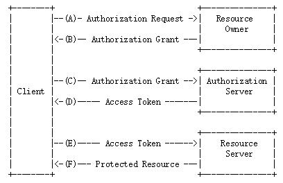

# spring-security-oauth2

## 1. 理解OAuth 2.0
[OAuth](https://en.wikipedia.org/wiki/OAuth)是一个关于授权（authorization）的开放网络标准，在全世界得到广泛应用，目前的版本是2.0版。
## 2. 协议的参与者
OAuth2.0相关的专业术语：
* RO (Resource Owner): 资源所有者，对资源具有授权能力的人。
* Third-party application：第三方应用程序，又称"客户端"（client）。
* HTTP service：HTTP服务提供商。
* User Agent：用户代理，本文中是指浏览器。
* AS (Authorization Server): 授权服务器，它认证RO的身份，为RO提供授权审批流程，并最终颁发授权令牌(Access Token)。
* RS (Resource Server): 资源服务器，即服务提供商存放用户资源的服务器。读者请注意，为了便于协议的描述，这里只是在逻辑上把AS与RS区分开来；在物理上，AS与RS的功能可以由同一个服务器来提供服务。

## 3. OAuth流程
OAuth在"客户端"与"服务提供商"之间，设置了一个授权层（authorization layer）。"客户端"不能直接登录"服务提供商"，只能登录授权层，以此将用户与客户端区分开来。"客户端"登录授权层所用的令牌（token），与用户的密码不同。用户可以在登录的时候，指定授权层令牌的权限范围和有效期。

"客户端"登录授权层以后，"服务提供商"根据令牌的权限范围和有效期，向"客户端"开放用户储存的资料。

OAuth 2.0的运行流程如下图，摘自[RFC 6749](https://tools.ietf.org/html/rfc6749)。

> （A）用户打开客户端以后，客户端要求用户给予授权。
> （B）用户同意给予客户端授权。
> （C）客户端使用上一步获得的授权，向认证服务器申请令牌。
> （D）认证服务器对客户端进行认证以后，确认无误，同意发放令牌。
> （E）客户端使用令牌，向资源服务器申请获取资源。
> （F）资源服务器确认令牌无误，同意向客户端开放资源。

## 4. 客户端的授权模式
客户端必须得到用户的授权（authorization grant），才能获得令牌（access token）。OAuth 2.0定义了四种授权方式。
* [授权码模式](code-grant/README.md)（authorization code）
* [简化模式](implicit-grant/README.md)（implicit）
* [密码模式](password-grant/README.md)（resource owner password credentials）
* [客户端模式](client-grant/README.md)（client credentials）

说明：OAuth 2.0说明出自[理解OAuth 2.0](http://www.ruanyifeng.com/blog/2014/05/oauth_2_0.html), 代码取自网络